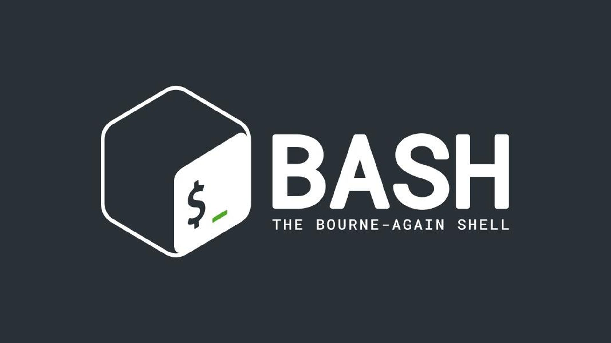

# Bash Scripting Projects
Welcome to my Bash scripting portfolio.

This repository contains small, practical Bash projects I built to strengthen my Linux command-line and scripting skills.

I use **Linux Mint as my main operating system**, so I use **GNOME Boxes** to run virtual machines for testing and experimenting with my scripts without affecting my main system. Inside the virtual machine, I use **Xubuntu Minimal** as a separate environment for practicing Bash scripting and safely experimenting with Linux commands.

